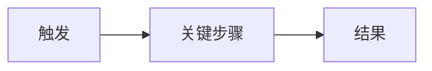
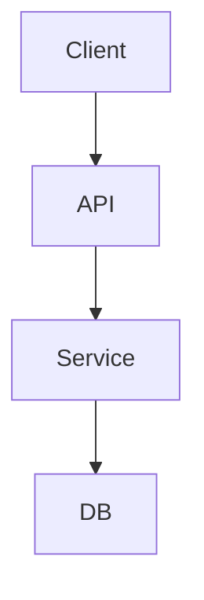
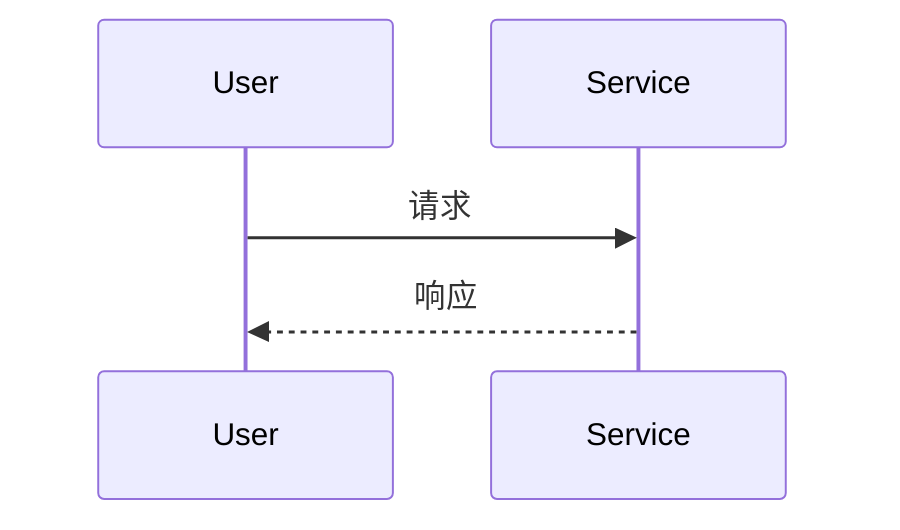
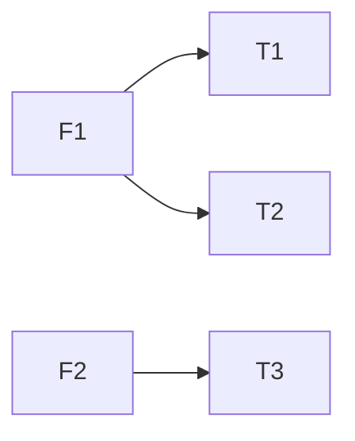

# Dev Docs

正式、简练的 **需求 / 设计 / 测试** 文档模板。无 Cordis 插件。
不用于 harness `docs/` 或 package README（那些用 `dsh-doc`）。

## When to load

- User asks to write or update 需求 / 设计 / 测试 / PRD / 验收 / test plan
- After coding, user asks to record decisions or test notes into docs (knowledge turn)
- Do **not** load during a pure `dev-loop` implement turn unless the user explicitly wants docs in that turn

## Style（必守）

| 原则 | 做法 |
|---|---|
| 正式 | 用语完整、可评审；少口语、无聊天语气 |
| 简练 | 一句说清一事；删空话与重复 |
| 好读 | **列表 / 表格优先**；长段拆成要点 |
| 好懂 | 有流程、关系、状态时 **必须配图**（见下） |
| 可验收 | 验收项可勾选、可测；避免模糊词（「尽快」「适当」） |
| 一文一事 | 用 `[[wikilink]]` 或相对路径互链 |
| 语言 | 业务文档默认中文；仓库 English-first 则跟仓库 |
| 禁止 | 聊天记录、完整 diff、密钥、未证实的 pass |

### 图（强制场景）

有下列任一情况时，至少放一张图（优先 Mermaid；复杂 UI 可用 ASCII 框）：

| 场景 | 推荐图类型 |
|---|---|
| 用户路径 / 业务步骤 | `flowchart` / `sequenceDiagram` |
| 系统边界 / 模块关系 | `flowchart` C4 风格或组件图 |
| 状态变迁 | `stateDiagram-v2` |
| 数据或调用链 | `sequenceDiagram` |
| 表结构 / 字段关系 | 表格 + 可选 ER（`erDiagram`） |

图旁用 1～3 条要点说明「读图要点」，不复述图中全部文字。

### 版式习惯

- 标题层级：`#` 文档名 → `##` 章节 → `###` 小节
- 元信息用表（状态、优先级、负责人、日期）
- 对比用表；步骤用有序列表；枚举用无序列表
- 每节先结论/要点，再细节；无内容的节写 `无` 或删节，勿留空壳占位废话

## Placement

| Kind | Default path (knowledge turn) | Alternate |
|---|---|---|
| Requirement | `.wiki/wiki/topics/<slug>-req.md` | product repo `docs/requirements/` |
| Design / ADR | `.wiki/wiki/topics/<slug>-design.md` | product repo `docs/design/` |
| Test plan / report | `.wiki/wiki/topics/<slug>-test.md` | product repo `docs/test/` |

Update branch indexes and `_index.md` via `llm-wiki` write path when writing under `.wiki/`.
While `dev-loop` is implementing **code**, do not write `.wiki/` — finish code, then a docs turn (or the user edits).

## Templates

### Requirement

````markdown
# <标题>

| 项 | 内容 |
|---|---|
| 状态 | 草稿 / 评审中 / 已定稿 |
| 优先级 | P0 / P1 / P2 |
| 负责人 | … |
| 更新日期 | YYYY-MM-DD |

## 1. 背景与目标

| 项 | 说明 |
|---|---|
| 背景 | 为何现在做（现状痛点，1～3 句） |
| 目标 | 一句话业务目标 |
| 成功标准 | 可度量的结果 |

## 2. 范围

| 类型 | 条目 |
|---|---|
| In | … |
| Out | … |

## 3. 角色与场景

| 角色 | 诉求 |
|---|---|
| … | … |

### 主流程



- 读图要点：…

### 场景列表

| ID | 场景 | 前置 | 主路径 | 异常 |
|---|---|---|---|---|
| S1 | … | … | … | … |

## 4. 功能要点

| ID | 能力 | 说明 | 优先级 |
|---|---|---|---|
| F1 | … | … | P0 |

## 5. 非功能（按需）

| 类别 | 要求 |
|---|---|
| 性能 / 安全 / 兼容 / 可运维 | … 或「无额外要求」 |

## 6. 验收标准

- [ ] …
- [ ] …

## 7. 依赖与风险

| 类型 | 说明 | 应对 |
|---|---|---|
| 依赖 | … | … |
| 风险 | … | … |

## 8. 链接

| 类型 | 链接 |
|---|---|
| Design | [[…]] |
| Test | [[…]] |
| Inventory | … |
````

### Design

````markdown
# <标题> — 设计

| 项 | 内容 |
|---|---|
| 状态 | 草稿 / 已采纳 / 已废弃 |
| 对应需求 | [[…-req]] |
| 更新日期 | YYYY-MM-DD |

## 1. 背景

- 要解决的问题：…
- 约束：…

## 2. 决策摘要

> 一句话：选定什么方案、解决什么问题。

## 3. 方案说明

### 结构 / 边界



- 读图要点：…

### 关键流程（按需）



### 接口 / 数据（按需）

| 名称 | 方向 | 要点 |
|---|---|---|
| … | in/out | 字段或契约摘要 |

## 4. 后果

| 类型 | 说明 |
|---|---|
| 收益 | … |
| 代价 / 后续 | … |

## 5. 备选方案

| 方案 | 结论 | 原因 |
|---|---|---|
| A | 未选 | … |
| B | 未选 | … |

## 6. 链接

| 类型 | 链接 |
|---|---|
| Requirement | [[…]] |
| Test | [[…]] |
````

### Test

````markdown
# <标题> — 测试

| 项 | 内容 |
|---|---|
| 状态 | 计划中 / 执行中 / 已完成 |
| 对应需求 | [[…-req]] |
| 对应设计 | [[…-design]] |
| 更新日期 | YYYY-MM-DD |

## 1. 范围与策略

| 项 | 说明 |
|---|---|
| 覆盖验收 | 列出对应 Acceptance ID / 条文 |
| 策略 | 单测 / 集成 / 手工 / E2E（勾选实际用到的） |
| 环境 | … |

### 覆盖关系（按需）



## 2. 用例

| ID | 用例 | 步骤 | 预期 | 结果 |
|---|---|---|---|---|
| T1 | … | 1. … 2. … | … | pass / fail / blocked / 未跑 |

## 3. 验证命令

```sh
# 仓库内最小验证命令（可复制）
```

## 4. 缺陷与风险

| ID | 问题 | 严重度 | 状态 | 说明 |
|---|---|---|---|---|
| D1 | … | 高/中/低 | open/fixed | … |

## 5. 结论

| 项 | 内容 |
|---|---|
| 是否可发布 | 是 / 否 / 有条件 |
| 残留风险 | … 或「无」 |

## 6. 链接

| 类型 | 链接 |
|---|---|
| Requirement | [[…]] |
| Design | [[…]] |
````

## Human gates

- 非琐碎改动：需求 **定稿** 后再大范围实现 — 先请用户确认。
- 测试表 **Result**：无命令输出或用户签字，不得标 pass。

## Out of scope

- Coding / git / branch → `dev-loop` / `git-flow`
- Harness 文档站 / package README → `dsh-doc`
- 任意上传入库 → `llm-wiki`
