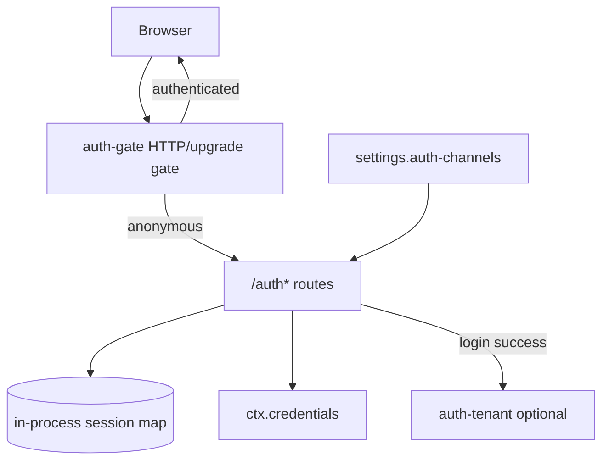
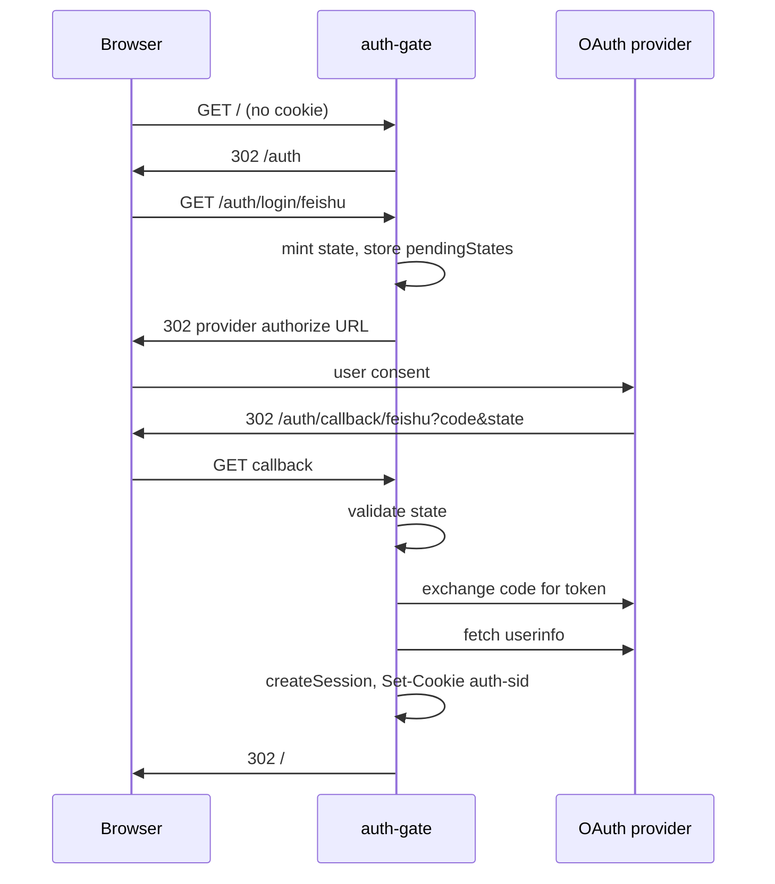

# @deepseek-ai/dsh-host-auth-gate

English | [中文](README.zh.md)

OAuth2 login gateway for the web host: administrators configure third-party login channels in Settings UI; end users sign in through `/auth`. Once at least one usable channel exists, anonymous traffic is refused.

## Purpose

| Role | What this package provides |
|------|---------------------------|
| **Administrator** | Configure Feishu / DingTalk / WeCom / WeChat-scan under Settings → Login channels |
| **End user** | Browser login, current-account panel, logout |
| **Host plugin** | Registers `/auth*` routes, issues the `auth-sid` cookie, gates HTTP and WebSocket traffic |

This package does **not** isolate per-user data. Mount `auth-tenant` alongside it when session-level isolation is required.

## Quick start

1. Start the web UI: `pnpm dsh web` (`web-app` mounts this plugin with no cordis config).
2. Open **Settings → Login channels**, pick a channel (for example Feishu), and fill **App ID**, **App secret**, and **Redirect URI**.
3. Register the callback URL on the provider console; it must match **Redirect URI** in settings (defaults to the current page origin, for example `http://127.0.0.1:3080/auth/callback/feishu`).
4. Save and enable the channel. After at least one channel is fully configured, refresh: unauthenticated users are redirected to `/auth`.
5. Use the sidebar **Account** panel to inspect the signed-in user and **Log out**.

**First-time setup:** with no usable channel, the login gate stays **off** so administrators can reach settings first.

## Design

### Components

- **Host half** (`src/index.ts`): OAuth routes, cookie sessions, `ctx.webServer` gate.
- **Client half** (`src/client/`): Settings “Login channels” card and sidebar account panel.
- **Credentials:** app secrets are stored through `ctx.credentials.set` under managed refs such as `AUTH_FEISHU_APP_SECRET`; the settings UI accepts a password field and **never echoes plaintext**.
- **Sessions:** `auth-sid` cookie plus an in-process `Map`; see [Known limitations](#known-limitations-and-deferred-work).

### Login flow

With exactly one usable channel, `/auth` **skips the chooser** and redirects straight to `/auth/login/:channel`.

### HTTP routes

| Path | Method | Behavior |
|------|--------|----------|
| `/auth` | GET | Login landing; single channel starts OAuth immediately |
| `/auth/login/:channel` | GET | Start OAuth for the channel id from settings (for example `feishu`) |
| `/auth/callback/:channel` | GET | OAuth callback; sets cookie and redirects to `/` |
| `/auth/me` | GET | Current user JSON; `401` when unauthenticated |
| `/auth/logout` | GET | Clears session and cookie, redirects to `/auth` |

### Gate behavior

The gate activates when **at least one** channel has `enabled`, non-empty `appId`, `appSecretRef`, and `redirectUri`:

| Request kind | Anonymous behavior |
|--------------|-------------------|
| HTML pages | `302` → `/auth` |
| `/api/*` | `401` JSON `{ "error": "authentication required" }` |
| WebSocket upgrade | connection destroyed |
| `/auth`, `/auth/*` | always allowed |

## Configuration

This plugin has **no cordis Config**. Mount it to enable OAuth; configure channels only in **Settings → Login channels**.

### Built-in channels

| Channel id | Label |
|------------|-------|
| `feishu` | Feishu |
| `dingtalk` | DingTalk |
| `wecom` | WeCom |
| `wechat-scan` | WeChat scan |

Changes apply **live** without restarting the process.

### Channel fields (Settings UI)

| Field | Required | Notes |
|-------|----------|-------|
| `preset` | yes | one of the built-in ids above (same as channel id) |
| `enabled` | no | defaults to `true` |
| `appId` | yes | provider application id |
| `appSecretRef` | yes | credential ref; client UI defaults to `AUTH_<CHANNEL>_APP_SECRET` |
| `redirectUri` | yes | must match the provider console; loopback hosts auto-align port from the request |

## Working with auth-tenant

When `auth-tenant` is also composed, a successful OAuth callback calls `authTenant.bindAuthPrincipal` and records the resolved `tenantId` on the session user. See that package README for tenant isolation details.

## Model Experience

None; authentication is a host/browser concern and does not reach model requests.

#### KV Cache effect

None; this package neither assembles nor sends a provider request.

## Known limitations and deferred work

- **No automated connectivity probe yet** — “Test login” opens the OAuth redirect; automatic token/state probing is deferred.
- **Sessions are in-memory only** — process restart drops every `auth-sid`; durable sessions (storageDomain / signed cookie) are deferred.
- **Tenant isolation is optional and incomplete** — `auth-tenant` may tag a session and filter Sessions API calls; it does not provide per-principal homes or process isolation.
