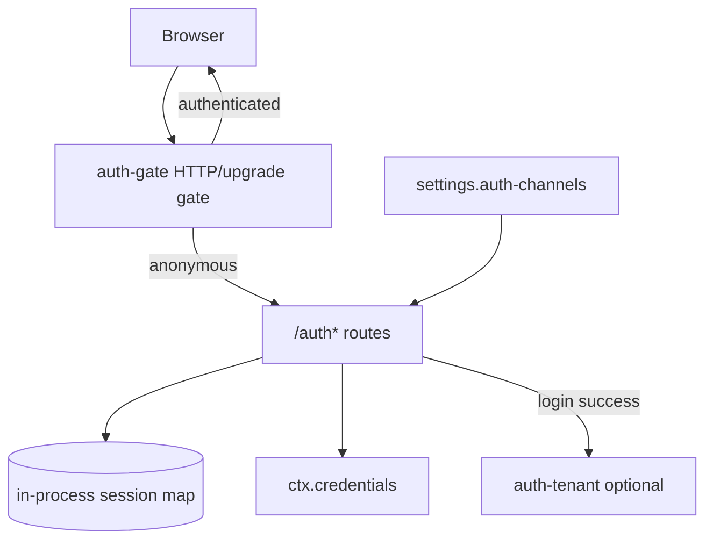
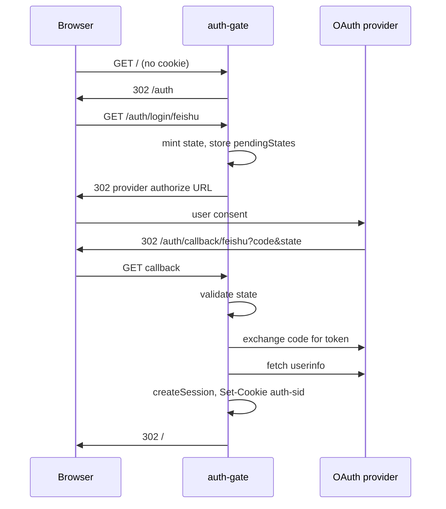

# @deepseek-ai/dsh-host-auth-gate

[English](README.md) | 中文

Web Host 的 OAuth2 登录网关：管理员在设置 UI 配置第三方登录渠道，终端用户经 `/auth` 登录；配齐至少一条可用渠道后，未登录访问会被拦截。

## 用途

| 角色 | 本包提供什么 |
|------|-------------|
| **管理员** | 在 Web UI「设置 → 登录渠道」配置飞书 / 钉钉 / 企业微信 / 微信扫码 |
| **终端用户** | 浏览器登录、查看当前账号、退出登录 |
| **Host 插件** | 注册 `/auth*` 路由、签发 `auth-sid` cookie、在 HTTP/WebSocket 层拦截匿名流量 |

本包**不**做按用户的数据隔离；需要 session 级隔离时与 [`auth-tenant`](../auth-tenant/README.zh.md) 一起挂载。

## 快速开始

1. 启动 Web：`pnpm dsh web`（`web-app` bundle 已默认挂载本插件，无 cordis config）。
2. 打开 **设置 → 登录渠道**，选择渠道（例如飞书），填写 **应用 ID**、**应用密钥**、**回调地址**。
3. 在对应开放平台登记回调 URL，须与设置页中的 **回调地址** 一致（默认取当前页面 origin，例如 `http://127.0.0.1:3080/auth/callback/feishu`）。
4. 保存并启用渠道。至少一条渠道配齐后，刷新页面：未登录用户会被重定向到 `/auth`。
5. 侧栏底部 **账号** 面板可查看当前用户并 **退出登录**。

**首次配置提示**：尚无任何可用渠道时，登录门禁**关闭**，便于管理员先进入设置页完成配置。

## 设计

### 组件关系

- **Host 半**（本包 `src/index.ts`）：OAuth 路由、cookie session、`ctx.webServer` 门禁。
- **Client 半**（`src/client/`）：设置页「登录渠道」卡片、侧栏账号面板。
- **凭据**：应用密钥经 `ctx.credentials.set` 写入托管引用（如 `AUTH_FEISHU_APP_SECRET`），设置页用密码框录入，**不回显明文**。
- **Session**：`auth-sid` cookie + 进程内 `Map`；详见 [已知限制](#known-limitations-and-deferred-work)。

### 登录流程

仅一条可用渠道时，`/auth` **跳过选择页**，直接 302 到该渠道的 `/auth/login/:channel`。

### HTTP 路由

| 路径 | 方法 | 说明 |
|------|------|------|
| `/auth` | GET | 登录 landing；单渠道时直接发起 OAuth |
| `/auth/login/:channel` | GET | 发起指定渠道 OAuth（`channel` = 设置中的渠道 id，如 `feishu`） |
| `/auth/callback/:channel` | GET | OAuth 回调；成功后写 cookie 并 302 到 `/` |
| `/auth/me` | GET | 当前用户 JSON；未登录返回 `401` |
| `/auth/logout` | GET | 清除 session 与 cookie，302 到 `/auth` |

### 门禁规则

当**至少一条**渠道同时满足 `enabled`、非空 `appId`、`appSecretRef`、`redirectUri` 时，门禁激活：

| 请求类型 | 未登录行为 |
|----------|-----------|
| 普通页面 | `302` → `/auth` |
| `/api/*` | `401` JSON `{ "error": "authentication required" }` |
| WebSocket upgrade | 直接断开连接 |
| `/auth`、`/auth/*` | 始终放行 |

## 配置

本插件**无 cordis Config**。挂载即用；渠道只在 **设置 → 登录渠道** 配置。

### 内置渠道

| 渠道 id | 显示名 |
|---------|--------|
| `feishu` | 飞书 |
| `dingtalk` | 钉钉 |
| `wecom` | 企业微信 |
| `wechat-scan` | 微信扫码 |

保存后**热生效**，无需重启进程。

### 渠道字段（Settings UI）

| 字段 | 必填 | 说明 |
|------|------|------|
| `preset` | 是 | 上表之一（与渠道 id 相同） |
| `enabled` | 否 | 默认 `true` |
| `appId` | 是 | 开放平台应用 ID |
| `appSecretRef` | 是 | 凭据引用名；UI 默认 `AUTH_<CHANNEL>_APP_SECRET` |
| `redirectUri` | 是 | 须与开放平台登记一致；本地 loopback 时会按请求 Host 自动对齐端口 |

## 与 auth-tenant 配合

同时挂载 [`auth-tenant`](../auth-tenant/README.zh.md) 时，OAuth 回调成功后会调用 `authTenant.bindAuthPrincipal`，把解析出的 `tenantId` 写入 session 用户资料。详见该包 README 中的租户隔离说明。

## 模型体验

无；认证是 Host/浏览器职责，不进入模型请求。

#### KV Cache 影响

无；本包既不组装也不发送提供商请求。

## 已知限制与暂缓工作

- **尚无连通性探测** —「测试登录」打开 OAuth 跳转；自动 token/状态探测暂缓。
- **Session 仅内存** — 进程重启丢失全部 `auth-sid`；持久化（storageDomain / 签名 cookie）暂缓。
- **租户隔离可选且不完整** — `auth-tenant` 可给 session 打标并过滤 Sessions API；不提供按主体的 home 或进程隔离。
