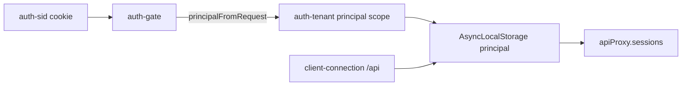
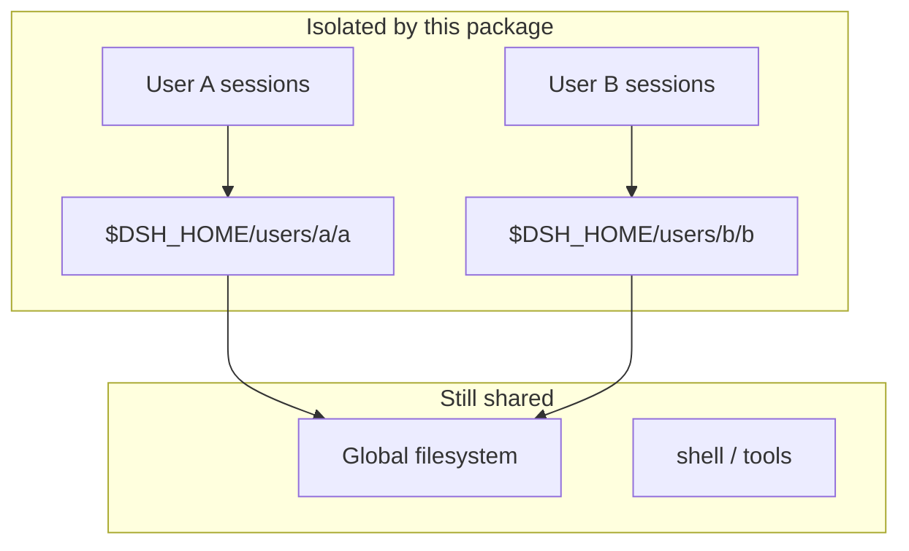
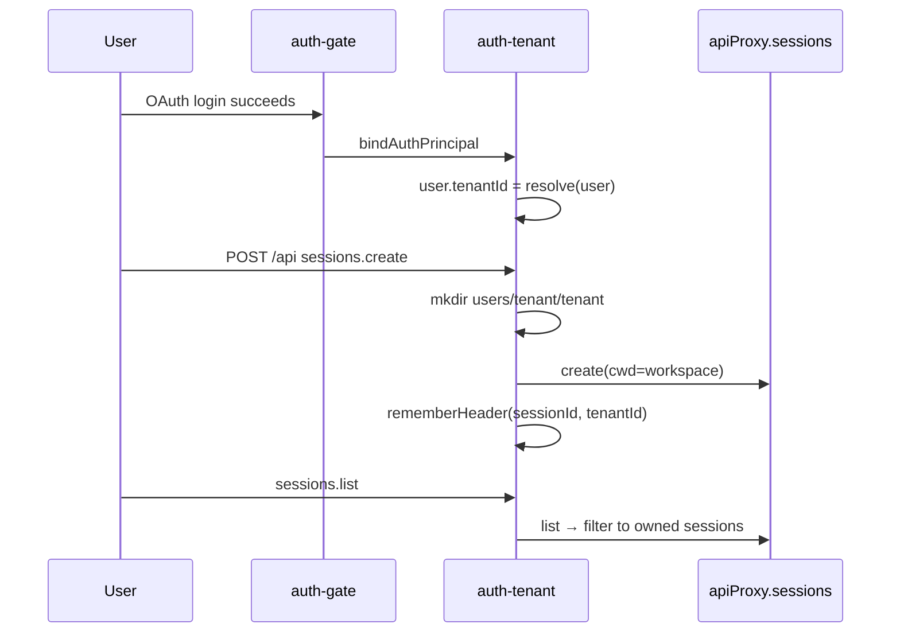

# @deepseek-ai/dsh-host-auth-tenant

English | [中文](README.zh.md)

Per-user tenant isolation for the web host: signed-in users can list, create, and mutate only their own agent sessions; new sessions get a dedicated workspace directory.

## Purpose

| Capability | Description |
|------------|-------------|
| **Session ownership** | Each agent session is bound to the signed-in user's `tenantId` |
| **Sessions API filtering** | `list` / `search` return only owned sessions; mutating calls reject cross-tenant access |
| **Workspace cwd** | New sessions use `$DSH_HOME/users/<tenant>/<tenant>` as `cwd` (basename matches picker title) |
| **Durable ownership (P0)** | `SessionHeader.tenantId` is persisted; filtering survives process restart |
| **Credential isolation (P1)** | Model API keys live in `$DSH_HOME/users/<tenant>/.credentials.yaml`; `AUTH_*` OAuth secrets stay global |
| **Settings isolation (P1)** | Per-tenant user layers in `$DSH_HOME/users/<tenant>/settings.yaml`; `auth-channels` stays global; `ctx.settings.get()` overlays tenant layers at runtime |
| **Events isolation** | `events.mux` / `events.host` drop frames for sessions outside the authenticated tenant |
| **Runtime tenant policy** | Stamps `tenantIsolation` on `ctx.sandboxPolicy.resolve()` so fs-sandbox, bwrap/seatbelt, and subprocess argv enforce `$DSH_HOME/users/` containment |

**Prerequisite:** mount [`auth-gate`](../auth-gate/README.md) first and establish a valid `auth-sid` cookie. This package reads the cookie session and carries the principal through `/api` request handling.

**Out of scope:** not full multi-tenancy — session persistence remains co-located and Landlock/bash parity for tenant reads is partial on some platforms.

## Quick start

The `web-app` bundle mounts this plugin with no config:

```yaml
- id: auth-tenant
  name: '@deepseek-ai/dsh-host-auth-tenant'
```

Login channels and other UI-owned values stay in Settings (frontend). This plugin does not accept cordis `config` overrides.

1. Complete OAuth setup per [`auth-gate`](../auth-gate/README.md) (channels via Settings UI).
2. Sign in as user A and user B separately; each creates a session.
3. User A's session list **does not** show user B's sessions; direct calls with B's session id return `403 forbidden`.

## Design

### Relationship to auth-gate



1. **At login** (`auth-gate` callback): `authTenant.bindAuthPrincipal` resolves `tenantId`, stores it on `AuthUser.tenantId`, and registers `$DSH_HOME/users/<tenant>/<tenant>` in the workspace registry with the lowercase english-name slug as the display title (Feishu `en_name` is often ALL CAPS).
2. **On `/api` requests** (`client-connection` bridge + this package's scope): read the principal from the cookie and run the full connection dispatch chain inside `AsyncLocalStorage` (including privileged methods and Typert intercepts).
3. **On Sessions RPC** (this package's patch): filter or reject based on the principal's `tenantId`.

### Tenant id resolution

Always a per-user slug from `englishName` or `userId` (lowercase, `[a-z0-9._-]` only):

| Profile | Resulting tenantId |
|---------|-------------------|
| `englishName: "Zhang San"`, `userId: ou_abc` | `zhang-san` |
| no `englishName`, `userId: ou_abc123` | `ou_abc123` |

### Isolation scope

| Isolated | Not isolated |
|----------|--------------|
| Sessions API: `list`, `search`, `create`, `history`, `prompt`, `fork`, … | Session persistence still shares one store |
| **`subagent.*`, `goal.*`, `GET /api/session.export`** | |
| New session `cwd` under per-user workspace | Other **workspace.*** RPC (rename, delete, reorder) and workspace host frames |
| **`workspace.list`** filtered to the tenant workspace path | |
| Durable `SessionHeader.tenantId` ownership | Workspace host frames remain shared |
| Credentials API + agent runtime (tenant `.credentials.yaml`) | |
| Settings API + `ctx.settings.get()` tenant overlay | |
| `events.mux` / `events.host` session filtering | |
| `$DSH_HOME/users/<tenant>/` via sandbox policy (fs, bwrap/seatbelt, subprocess argv) | Paths outside `$DSH_HOME/users/` (shared project trees) |



### Session lifecycle



## Configuration

This plugin has **no cordis Config**. Mount it to enable isolation; leave UI-owned values (login channels, model providers, permission presets) to the Settings UI and credentials API.

Fixed in code (not configurable):

- Credential refs with the `AUTH_` prefix stay on the global store (OAuth app secrets).
- The `auth-channels` settings namespace stays on the global document.
- Tenant settings writes go through the API overlay (`update` / `replace` / `mutate`); the shared `ui-settings` base stays unchanged.

### Workspace path

```text
$DSH_HOME/users/<tenantId>/<tenantId>
```

Created recursively on login and on first session creation.

## Working with auth-gate

| Step | Owner |
|------|-------|
| User login and cookie issuance | `auth-gate` |
| Resolve and store `tenantId` on the session user | `auth-tenant` (at callback) |
| Block anonymous `/api` | `auth-gate` |
| Serve `/api` under a principal | `auth-tenant` (via `client-connection` bridge scope) |
| Filter Sessions / Events RPC | `auth-tenant` |

Both plugins are mounted adjacently in the [`web-app`](../../bundle/web-app/cordis.patch.yml) bundle: `auth-gate` first, `auth-tenant` second.

## Model Experience

None; tenant tagging is a host/API concern and does not reach model requests.

#### KV Cache effect

None; this package neither assembles nor sends a provider request.

## Known Limitations and Deferred Work

- **API-layer isolation only** — filesystem and shell remain shared unless other plugins add policy.
- **Header-backed ownership** — live session headers plus a cold header cache from persistence; create stamps a stub header until `session/created` refreshes it.
- **Workspace host frames** — `events.host` workspace notifications are not tenant-scoped yet.
- **Remaining `/api` namespaces** — workspace RPC and similar surfaces (P1) are not tenant-filtered in this slice.
