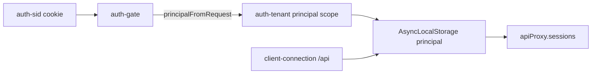
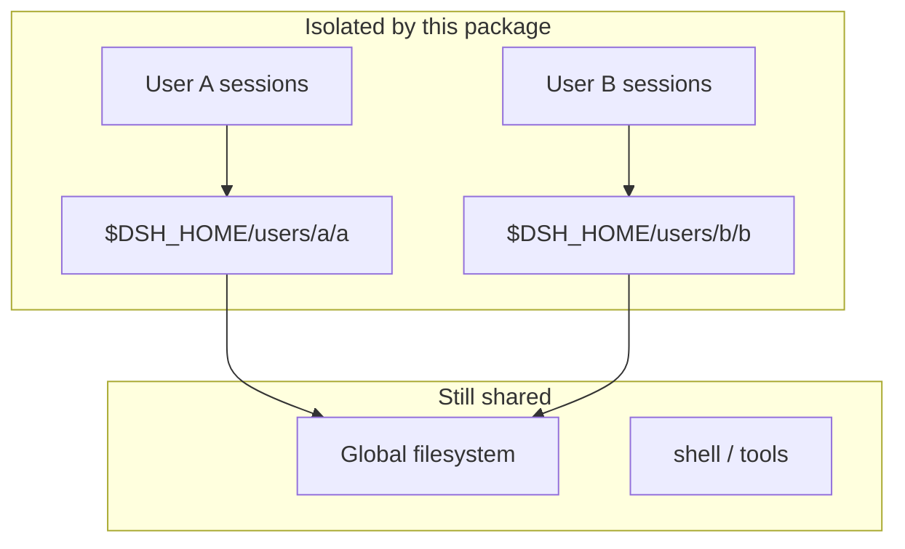
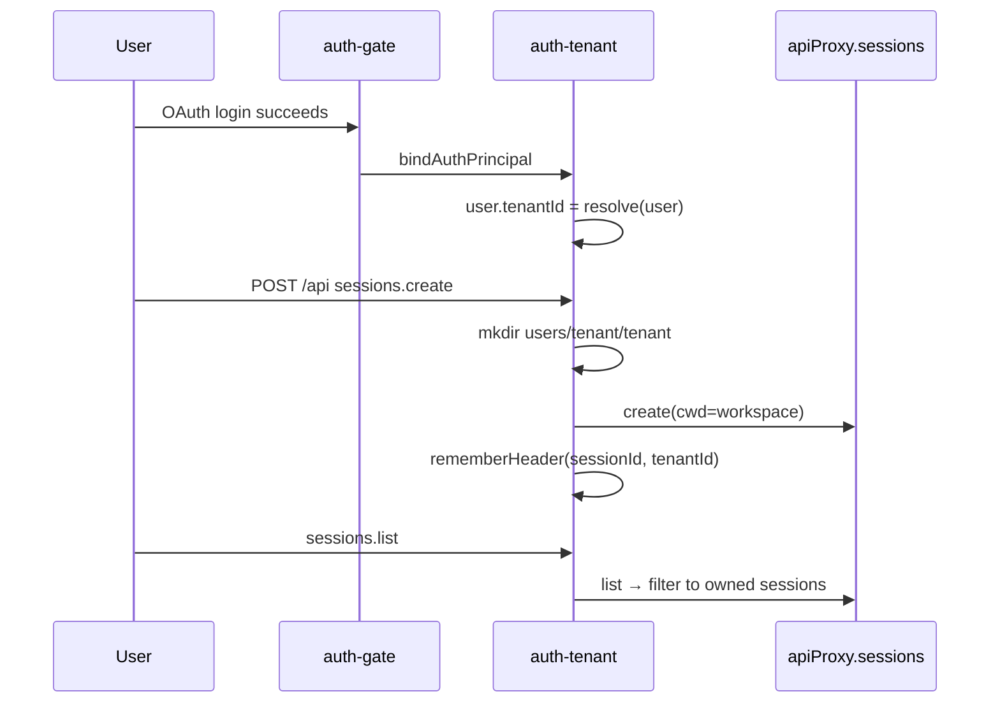

# @deepseek-ai/dsh-host-auth-tenant

[English](README.md) | 中文

Web Host 的按用户租户隔离：登录用户只能列出、创建和操作自己的 agent session；新建 session 时把工作目录钉到该用户的专属 workspace。

## 用途

| 能力 | 说明 |
|------|------|
| **Session 归属** | 每个 agent session 绑定到登录用户的 `tenantId` |
| **Sessions API 过滤** | `list` / `search` 只返回本人 session；`create` / `history` / `prompt` 等拒绝越权 |
| **工作目录** | 新建 session 的 `cwd` 设为 `$DSH_HOME/users/<tenant>/<tenant>`（目录名与选择器标题一致） |
| **持久归属（P0）** | `SessionHeader.tenantId` 写入磁盘；重启后仍按 header 过滤 |
| **凭据隔离（P1）** | 模型 API Key 等写入 `$DSH_HOME/users/<tenant>/.credentials.yaml`；`AUTH_*` OAuth 密钥仍全局 |
| **设置隔离（P1）** | 非全局 namespace 的用户层写入 `$DSH_HOME/users/<tenant>/settings.yaml`；`auth-channels` 仍全局；运行时 `ctx.settings.get()` 叠加 tenant 层 |
| **Events 隔离** | `events.mux` / `events.host` 丢弃非本人 session 的帧 |
| **运行时租户策略** | 在 `ctx.sandboxPolicy.resolve()` 上注入 `tenantIsolation`，由 fs-sandbox、bwrap/seatbelt 与 subprocess argv 共同约束 `$DSH_HOME/users/` |

**前置条件**：必须先挂载 [`auth-gate`](../auth-gate/README.zh.md) 并提供有效 `auth-sid` cookie。本包从 cookie session 解析当前用户，在 `/api` 请求上下文中携带 principal。

**不做什么**：不提供完整多租户——session 持久化仍共库、部分平台 Landlock/bash 租户读隔离仍不完整、workspace 类 host 事件仍全局。

## 快速开始

`web-app` bundle 默认挂载本插件，**无 config**：

```yaml
- id: auth-tenant
  name: '@deepseek-ai/dsh-host-auth-tenant'
```

登录渠道等 UI 可配项留在设置页（前端）。本插件不接受 cordis `config` 覆盖。

1. 按 [`auth-gate`](../auth-gate/README.zh.md) 完成 OAuth（渠道在设置 UI 中配置）。
2. 用户 A、用户 B 分别登录，各自创建 session。
3. 用户 A 的 session 列表中**看不到**用户 B 的 session；尝试直接调用 B 的 session id 会收到 `403 forbidden`。

## 设计

### 与 auth-gate 的关系



1. **登录时**（`auth-gate` 回调）：`authTenant.bindAuthPrincipal` 解析 `tenantId`、写入 `AuthUser.tenantId`，并在 workspace 注册表中登记 `$DSH_HOME/users/<tenant>/<tenant>`，显示标题使用小写英文名 slug（飞书 `en_name` 常为大写）。
2. **`/api` 请求时**（`client-connection` bridge + 本包 scope）：从 cookie 取出 principal，在 `AsyncLocalStorage` 中运行整条 connection 分发链（含 privileged 方法与 Typert intercept）。
3. **Sessions RPC 时**（本包 patch）：按 principal 的 `tenantId` 过滤或拒绝。

### 租户 id 如何解析

始终按用户 slug：从 `englishName` 或 `userId` 生成（小写、仅保留 `[a-z0-9._-]`）。

| 用户资料 | 生成的 tenantId |
|----------|----------------|
| `englishName: "Zhang San"`, `userId: ou_abc` | `zhang-san` |
| 无 `englishName`, `userId: ou_abc123` | `ou_abc123` |

### 隔离范围

| 已隔离 | 未隔离 |
|--------|--------|
| Sessions API：`list`、`search`、`create`、`history`、`prompt`、`fork` 等 | session 持久化仍共库 |
| **`subagent.*`、`goal.*`、`GET /api/session.export`** | |
| 新建 session 的 `cwd` 指向用户 workspace | 其余 **workspace.\*** RPC（rename、delete、reorder）及 workspace host 事件 |
| **`workspace.list`** 仅返回该租户 workspace 路径 | |
| `SessionHeader.tenantId` 持久归属 | workspace 类 host 事件仍全局 |
| 凭据 API + agent 运行时（租户 `.credentials.yaml`） | |
| Settings API + 运行时 `ctx.settings.get()` tenant 叠加 | |
| `events.mux` / `events.host` session 过滤 | |
| sandbox policy 下的 `$DSH_HOME/users/<tenant>/`（fs、bwrap/seatbelt、subprocess argv） | `$DSH_HOME/users/` 之外的路径（共享项目树） |



### Session 生命周期



## 配置

本插件**无 cordis Config**。挂载即启用隔离；登录渠道、模型提供商、权限预设等 UI 可配项留在设置页与凭据 API。

代码内固定（不可配置）：

- `AUTH_` 前缀凭据走全局 store（OAuth 应用密钥）
- `auth-channels` namespace 走全局 settings 文档
- 租户 settings 写入通过 API overlay 完成（`update` / `replace` / `mutate`），底座 `ui-settings` 无需改动

### 工作区路径

```text
$DSH_HOME/users/<tenantId>/<tenantId>
```

登录时及用户首次创建 session 时递归创建。

## 与 auth-gate 配合

| 步骤 | 负责插件 |
|------|----------|
| 用户登录、签发 cookie | `auth-gate` |
| 解析 `tenantId` 写入 session 用户 | `auth-tenant`（回调时） |
| 拦截匿名 `/api` | `auth-gate` |
| 在 principal 上下文中服务 `/api` | `auth-tenant`（经 `client-connection` bridge scope） |
| 过滤 Sessions / Events RPC | `auth-tenant` |

两插件在 [`web-app`](../../bundle/web-app/cordis.patch.yml) bundle 中默认相邻挂载：`auth-gate` 在前，`auth-tenant` 在后。

## 模型体验

无；租户打标是 Host/API 职责，不进入模型请求。

#### KV Cache 影响

无；本包既不组装也不发送提供商请求。

## 已知限制与暂缓工作

- **仅 API 层隔离** — 文件系统与 shell 仍共享，除非其他插件补充策略。
- **Header 归属** — 以 live session header 与 persistence 冷缓存为准；create 会先写入 stub header，待 `session/created` 刷新。
- **Workspace host 事件** — `events.host` 的 workspace 通知尚未按 tenant 过滤。
- **其余 `/api` 命名空间** — workspace RPC 等（P1）本阶段未做 tenant 过滤。
